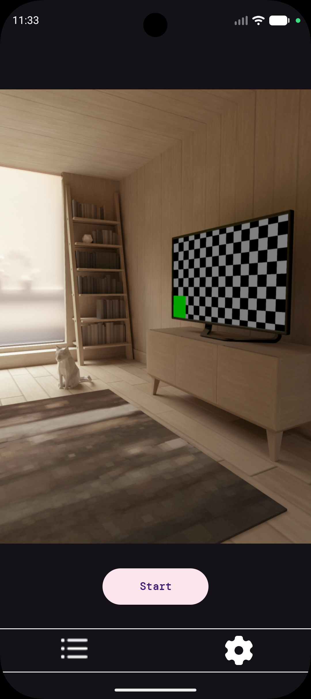
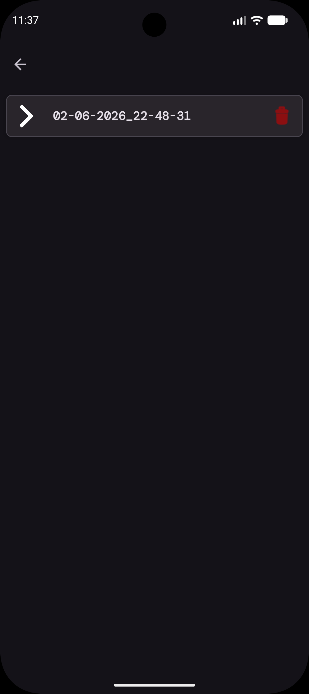
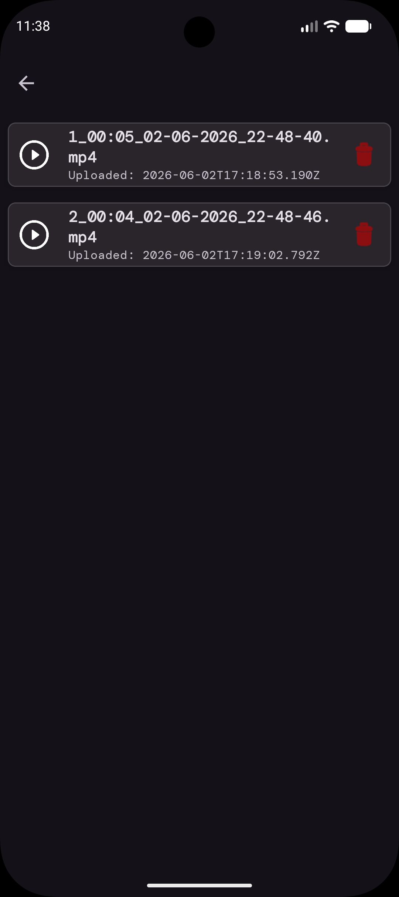
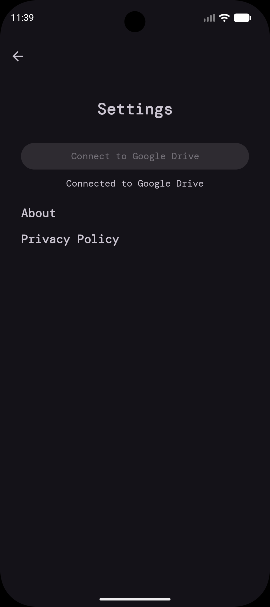

# 🎥 DriveSync Video Recorder

DriveSync Video Recorder is a powerful Android application designed to capture high-quality video and seamlessly synchronize it with your Google Drive. Whether you're recording for security, documentation, or personal memories, DriveSync ensures your videos are safely backed up and organized.

## ✨ Features

- 📹 **Smart Video Capture**: High-quality recording using the latest CameraX API.
- ☁️ **Google Drive Integration**: Automatic and manual syncing of recordings to your private Google Drive storage.
- 📁 **Session-Based Organization**: Recordings are neatly grouped into session folders for easy management.
- 🗑️ **Management Tools**: Quickly delete videos or entire session folders to manage your storage.
- 🔐 **Secure Access**: Built-in authentication system to protect your account.
- 🎥 **Integrated Player**: Watch your recorded videos directly within the app.
- ⚙️ **Customizable Settings**: Manage your Google Drive connection and configure app preferences.

## 📸 Screenshots

| Login | Recording | Video List | Settings |
| :---: | :---: | :---: | :---: |
|  |  |  |  |

## 🛠️ Technologies Used

- **Language**: Kotlin
- **UI Framework**: Android Jetpack (Compose/XML)
- **Camera**: CameraX
- **API**: Google Drive API v3
- **Architecture**: MVVM (Model-View-ViewModel)
- **Dependency Injection**: Manual / Hilt (if applicable)

---
